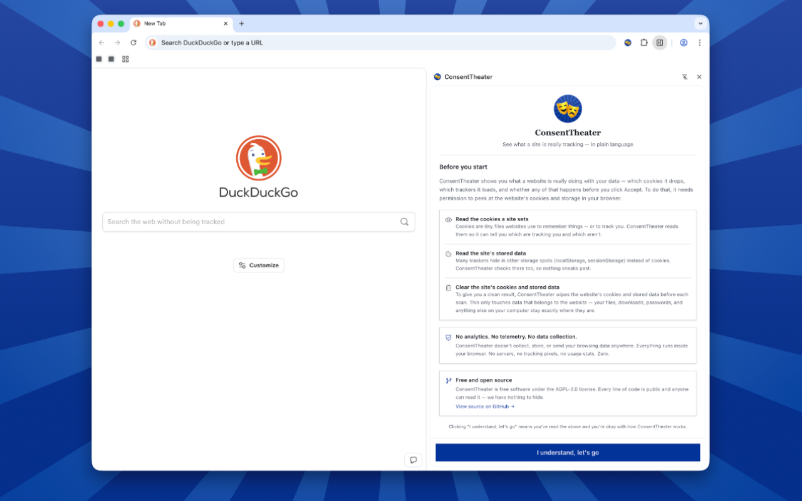
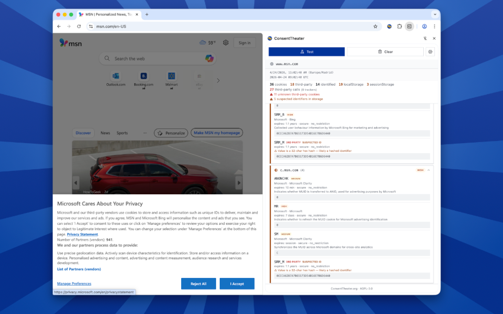
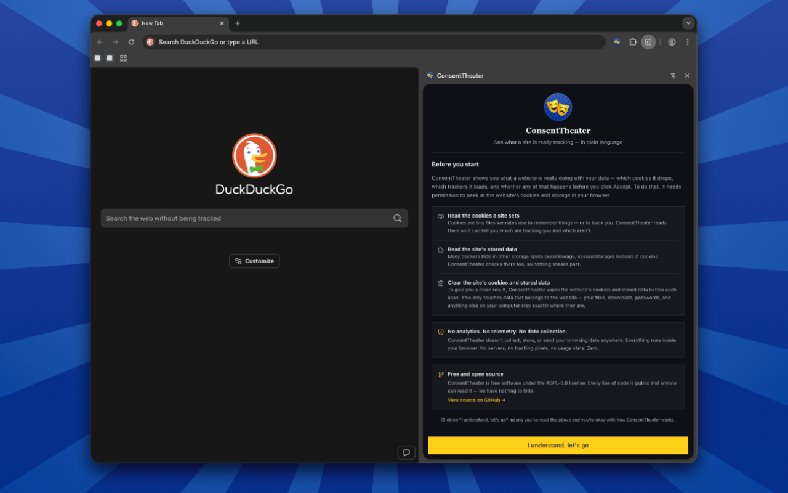
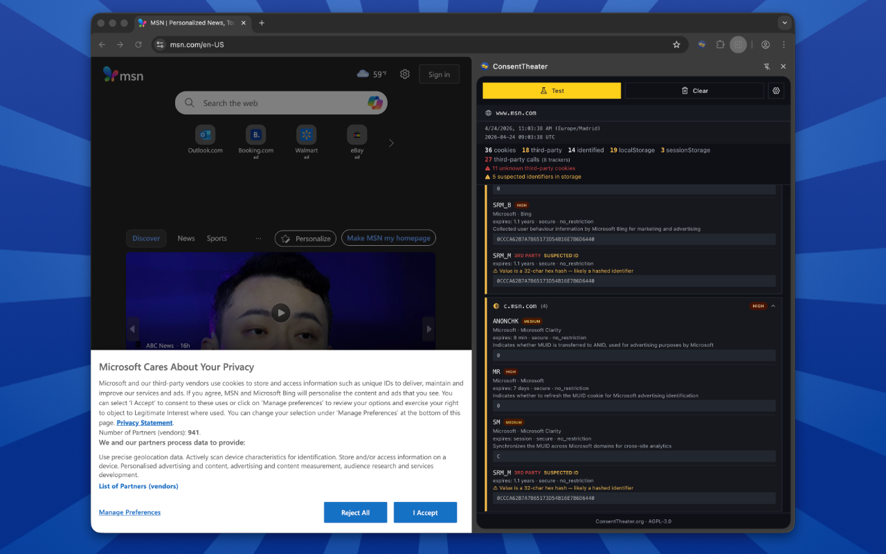
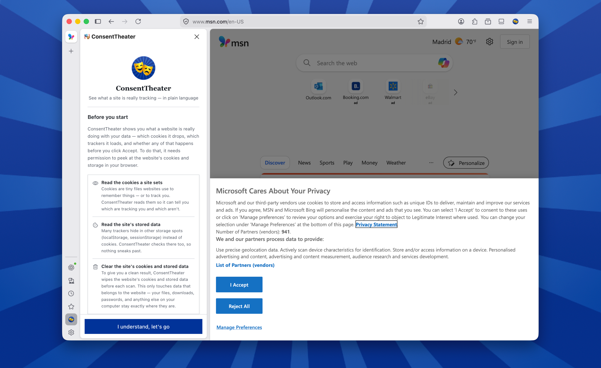
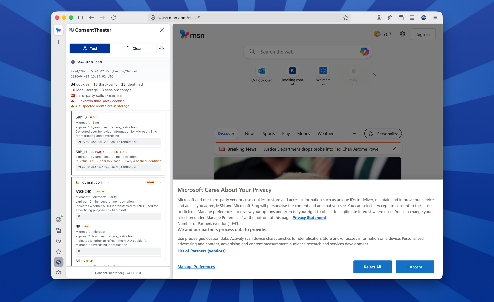
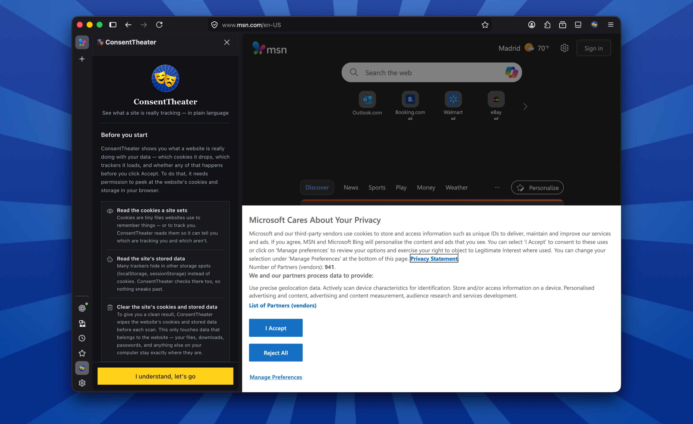
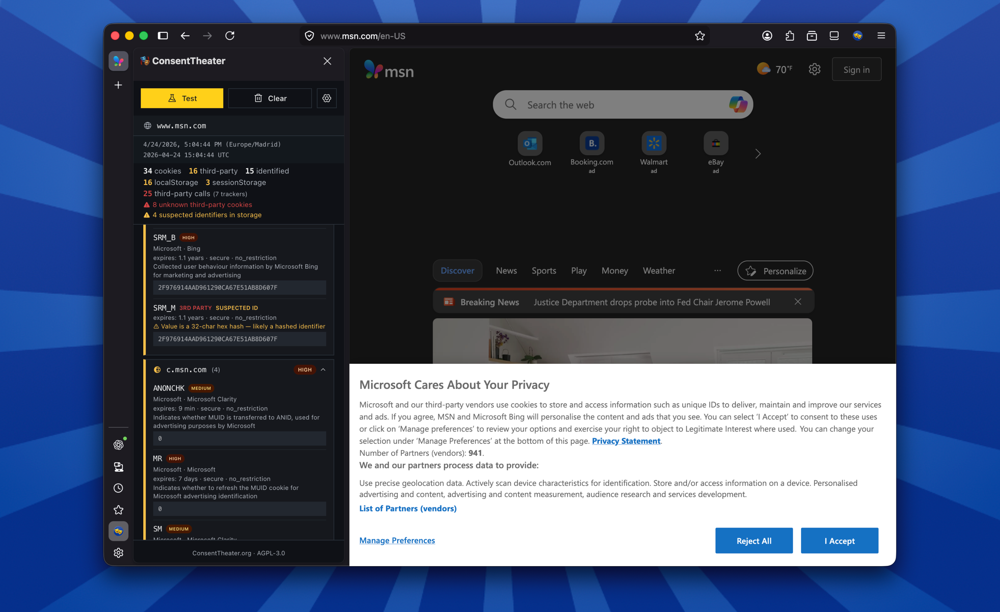

# ConsentTheater

[](https://github.com/ConsentTheater/extension/releases)
[](LICENSE)
[](#installation)
[](#installation)
[](https://github.com/ConsentTheater/extension/stargazers)
[](https://github.com/ConsentTheater/extension/network/members)
[](https://github.com/ConsentTheater/extension/watchers)
[](https://github.com/ConsentTheater/playbill)

**See what a website is really doing before you click Accept.**

Cookie banners are full of small print. ConsentTheater pulls back the curtain: open the sidebar,
press one button, and it tells you — in plain language — which trackers a site loads, which
cookies it drops, and whether any of that happens *before* you've agreed. No technical
background needed. If you can use a browser, you can use ConsentTheater.

> Built for regular people who want honest answers about the sites they visit. Developers,
> privacy researchers, and DPOs find it handy too — but you don't need to be one to get the
> full picture.

**[Learn more at consenttheater.org](https://consenttheater.org)**

## Features

- **One-click clean-slate scan** — wipes the site's cookies, localStorage, sessionStorage,
  IndexedDB, cache and service workers, then reloads. Every scan starts from a true first visit.
- **Catches pre-consent tracking** — the most common GDPR problem is trackers that fire
  *before* you accept the banner. ConsentTheater watches the page from the moment it loads
  and flags every tracker that sneaks in early.
- **Understands the banner** — finds Accept / Reject / Manage buttons and times the scan
  around your click, so "before you agreed" really means before you agreed.
- **Live third-party inspector** — always-on view of every cookie, every storage key, and
  every third-party host the current page contacts, bucketed into Trackers / CDN / Unknown.
- **Plain-language verdict** — Compliant, At Risk, Non-Compliant, Violating. Severity-based,
  no arbitrary scores.
- **Shareable report** — one click copies a clean summary you can paste to a friend, a
  support team, or (if you go that far) a regulator.
- **Privacy by design** — nothing leaves your browser. No server, no telemetry, no accounts.

## Screenshots

### Chrome

<p align="center">
  
  
</p>
<p align="center">
  
  
</p>

### Firefox

<p align="center">
  
  
</p>
<p align="center">
  
  
</p>

## Installation

### Install from Store (Recommended — coming soon)

[](#installation)
[](#installation)

Store listings are in preparation. Until they're live, use the manual install below.

<details>
<summary><strong>Manual Installation</strong></summary>

#### Chrome / Edge / Brave

```bash
npm install
npm run build:chrome
```

1. Open `chrome://extensions/` in your browser.
2. Turn on the **Developer mode** switch (top-right). This is just how browsers accept
   unpublished extensions — nothing on your end changes.
3. Click **Load unpacked** and pick the `dist/chrome/` folder this repo just built.
4. Pin the ConsentTheater icon to your toolbar for one-click access.

#### Firefox

```bash
npm install
npm run build:firefox
```

1. Open `about:debugging#/runtime/this-firefox`.
2. Click **Load Temporary Add-on...** and pick `dist/firefox/manifest.json`.

Safari isn't supported — its WebExtensions runtime lacks the sidebar APIs ConsentTheater
relies on.

</details>

## How it works

1. Open any website.
2. Click the **ConsentTheater icon** in your browser toolbar. A sidebar slides in and stays
   open while you browse.
3. Click **Scan this page**. ConsentTheater clears the site's cookies and stored data for
   you, reloads the page, and watches quietly.
4. In about six seconds — or the moment you click Accept / Reject on the cookie banner —
   you'll see the verdict.
5. Hit **Copy report** to share the findings, or **Rescan** to run it again. The **Live**
   tab shows every cookie, every storage entry, and every third-party call in real time.

The sidebar remembers where you are across tabs, so you can hop between sites and pick up
where you left off.

## The verdict

ConsentTheater doesn't hide behind a single number. Each issue carries a **severity** —
`critical`, `high`, `medium`, `low` — and the overall band is decided by what was found,
not by a formula:

| Band              | What it means                                                             |
| ----------------- | ------------------------------------------------------------------------- |
| **Compliant**     | No tracking before consent. Clean audit trail.                            |
| **At Risk**       | Only low-severity findings (data-leak-shaped things like fonts or CDNs a reviewer could argue either way on). |
| **Non-Compliant** | Medium or high findings — analytics / marketing tracking firing pre-consent, missing Reject button, dark-pattern banner. |
| **Violating**     | At least one **critical** finding — ad-tech pixel, cross-site fingerprinter, session-replay recording without consent. A single critical is enough. |

A site with one critical is Violating regardless of whatever else it does right. A site with
a scatter of lows lands in At Risk. The band is a starting point for the auditor, not a grade.

## Development

### Prerequisites

- Node.js 22+
- A Chromium-based browser for testing (Chrome, Edge, or Brave) and/or Firefox

### Setup

```bash
# Install dependencies
npm install

# Build for all browsers
npm run build:all

# Build for a specific browser
npm run build:chrome
npm run build:firefox

# Watch mode — rebuilds dist/<target>/ on every save
npm run dev:chrome

# Create store-ready zips
npm run release
```

### Testing & validation

```bash
# Unit tests (Vitest — covers src/lib/**)
npm run test

# Lint (ESLint with eslint-plugin-security)
npm run lint

# Typecheck (no emit)
npm run typecheck

# Chrome manifest + CSP validator
npm run validate:chrome

# Firefox validator (Mozilla's addons-linter)
npm run validate:firefox

# Everything: lint + test + chrome + firefox
npm run validate
```

### Project structure

```
src/
├── manifest/
│   ├── base.json            # shared manifest fields
│   ├── chrome.json          # MV3 service worker + side_panel + sidePanel permission
│   └── firefox.json         # MV3 + sidebar_action + scripts[] fallback
├── background/
│   └── background.ts        # webRequest + cookies observer, tabStates, sidebar wiring,
│                            # per-tab host counts, scan lifecycle, live-inspector queries
├── content/
│   └── content-script.ts    # banner detection, consent-click capture, page storage reader
├── ui/                      # Preact sidebar (Scan / Live / Settings views)
│   ├── components/          # shadcn-based primitives
│   ├── hooks/               # useCurrentTab, useLiveCookies, useSettings, useMessage
│   ├── state/               # ScanContext
│   ├── views/               # ConsentView, TestView, InspectView, LiveView, SettingsView
│   └── styles/              # Tailwind globals + EU-palette tokens
├── lib/
│   ├── browser-api.ts       # chrome/browser shim
│   ├── tracker-matcher.ts   # cookie + domain matching (pure, unit-tested)
│   ├── risk-score.ts        # band + violations (pure, unit-tested)
│   ├── pattern-detector.ts  # heuristic ID-pattern detection for unknown trackers
│   └── utils.ts             # cn() and friends
└── assets/icons/            # 16, 32, 48, 128
```

Tracker signatures come from **[@consenttheater/playbill](https://github.com/ConsentTheater/playbill)**
as an npm dependency — bundled into `background.js` at build time. The DB isn't vendored into
this repo; to update tracker coverage, bump the Playbill version.

Scans are strictly **on demand**. There's no passive analysis on every page —
`webRequest`/`cookies.onChanged` only attribute to the capture pipeline for tabs with an
active scan, and all scan state is cleared the moment the tab navigates or closes.

### Message protocol

Runtime messages between sidebar, content script and background. Single source of truth:
`src/ui/types/messages.ts`.

| Message             | Sender     | Effect                                                       |
| ------------------- | ---------- | ------------------------------------------------------------ |
| `runTest`           | sidebar    | Clear storage + cookies, reload tab, arm capture.            |
| `getState`          | sidebar    | Returns `{phase, hasReport, report}` for the tab.            |
| `getReport`         | sidebar    | Finalises scan if needed, returns `{report, phase}`.         |
| `getLiveCookies`    | sidebar    | Live inspector: cookies + third-party host counts + enrichment. |
| `getDbStats`        | sidebar    | Playbill stats (counts, version, tier, generated timestamp). |
| `clearAll`          | sidebar    | Wipe cookies + site storage for the current origin.          |
| `bannerDetected`    | content    | Records banner shape (accept / reject / manage buttons).     |
| `consentResolved`   | content    | Marks `consentResolvedAt` and which button was clicked.      |
| `storageData`       | content    | Response to `getStorage` — localStorage / sessionStorage / resource domains. |
| `cookiesChanged`    | background | Push — sidebar refreshes its live view.                      |
| `reportReady`       | background | Push — scan window expired, report available.                |
| `reportUpdated`     | background | Push — monitoring phase appended new trackers / cookies.     |

## Contributing

### Reporting bugs

Found a bug? [Open an issue](https://github.com/ConsentTheater/extension/issues/new) with:

- Browser + version
- Extension version (from Settings)
- Playbill version (from Settings → Playbill Database link)
- The URL you were scanning (or a public reproducer)
- Expected vs actual behaviour

### Suggesting features

[Submit a feature request](https://github.com/ConsentTheater/extension/issues/new) describing
the problem you're trying to solve, your proposed solution, and any alternatives considered.

### Adding trackers to the Playbill

Tracker signatures live in the separate **[Playbill](https://github.com/ConsentTheater/playbill)**
repo. If you find a tracker we miss, open a PR there — it's a JSON edit in the relevant actor
category. The extension picks up new entries on the next `npm install @consenttheater/playbill`
bump.

### Pull requests

1. Fork the repository.
2. Create a feature branch (`git checkout -b feat/your-feature`).
3. Make your changes. Keep the scope tight.
4. `npm run validate` passes (lint + test + Chrome validator + Mozilla's addons-linter).
5. Test both Chrome and Firefox builds manually.
6. Commit, push, open a PR.

## Privacy

Every scan runs inside your browser. ConsentTheater doesn't phone home, doesn't upload what
it finds, doesn't have a server, and has no accounts. The only network requests leaving your
machine are the ones the website itself would have made anyway — we just watch them.

## Changelog

See [GitHub Releases](https://github.com/ConsentTheater/extension/releases) for version
history and what changed in each build.

## License

**[AGPL-3.0-or-later](LICENSE)** — the GNU Affero General Public License.

ConsentTheater is free software. You can redistribute it and/or modify it under the terms of
the AGPL, version 3 or any later version.

The AGPL's §13 ensures that if you modify ConsentTheater and host it as a network service
(a SaaS GDPR scanner, a hosted audit tool, etc.), the modified source must be made available
to users of that service. In plain terms: this project is always free and always open, even
when run on a server.
